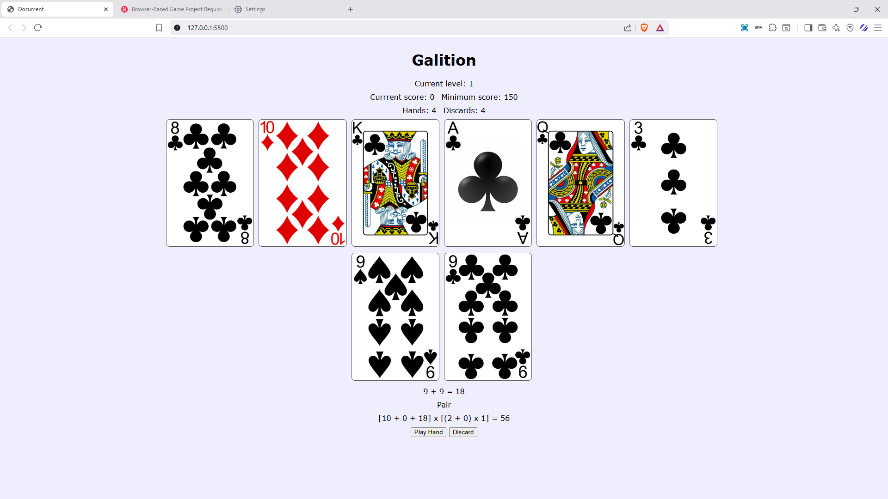
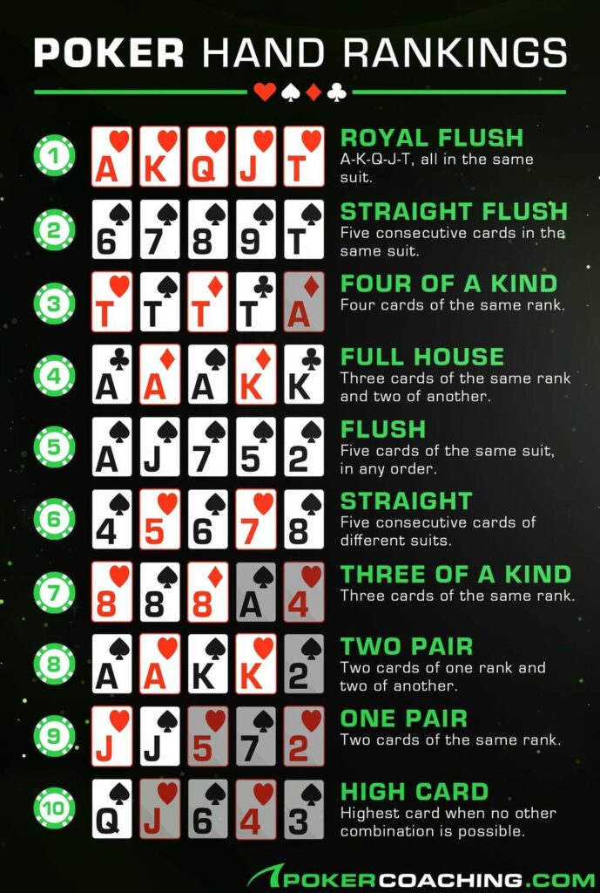

Galition is a poker rougelike where the goal is to complete all 3 levels by using cards to score poker hands.

You are dealt 8 cards out of a standard 52 card deck and by selecting up to 5 cards at once you can poker hands that increase your score. You can do this 4 times per level and cards that were used in that round are discarded and do not return to the deck until the level is complete. You also have 4 discards per level that allow you to draw up to 5 new cards without using up a scoring hand.

# Scoring

Base scoring is based on this table, which has two variables: the base value of the hand before the cards are counted, and its base multiplier:

High card: 5x1
Pair: 10x2
Two Pairs: 20x2
Three of a Kind: 30x3
Straight: 30x4
Flush: 35x4
Full House: 40x4
Four of a Kind: 60x7
Straight Flush: 100x8
Royal Flush: 100x8

_Image credit: https://pokercoaching.com/_

The actual value of the cards used will be added to the score, while any modifications (see below) to the multiplier will be added to the multiplier.

# Improving the score

After winning the level, you will given a set amount of money to spend on modifications.

There are 3 kinds of modifications:

+base score,
+multiplier, and
xmultiplier

The exact values will be based on the level they are bought and the number of modifications bought in the run, but the cost will increase accordingly until the next level is cleared.

# Winning and losing

Each stage has a set score which must be met or exceeded within the 4 hands allocated per level. Winning levels 1-2 will allow access to the shop and the next level, while winning the final level will result in victory. Not meeting the score in any level will result in the player losing the game.

# Stretch goal: artifacts

Artifacts are powerful modifications that affect the scoring (like a modifications) that cost more money that a single modification.

# Stretch goals: boss mods

Boss mods are level specific modifications that also affect the score.
**Resistances** negatively affect score based on it's conditions, while
**Weaknesses** positively affect score.

# Known limitations

Due to the short production time, the following quality of life and game play mechanics are missing:

- The cards are not sorted in any way. This will require a more effective way of storing the card items (including finding out a way to make a dynamic 2D linked list, bypassing the JS limitations of 2D arrays)
- All cards played are scored, removing some of the strategy of choosing specific cards. Again, this will require a refactor of how the cards are being handled internally to only score card that are part of a valid poker hand.

# Credits

- The game idea is from [Balatro](https://www.playbalatro.com/}).
- Card images are from [here](https://code.google.com/archive/p/vector-playing-cards/downloads).
